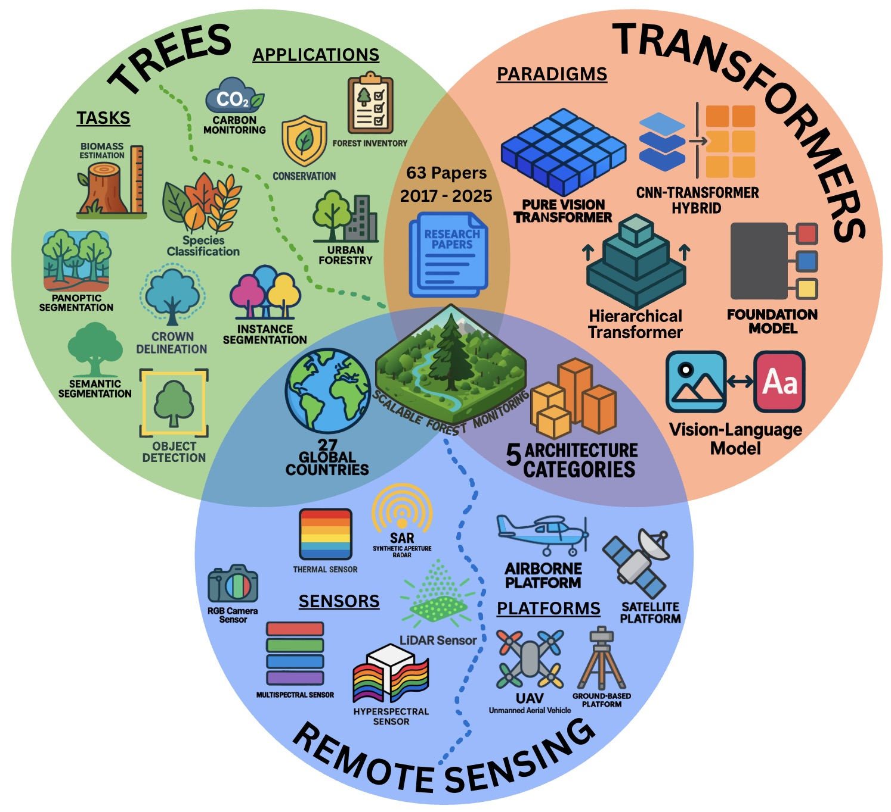
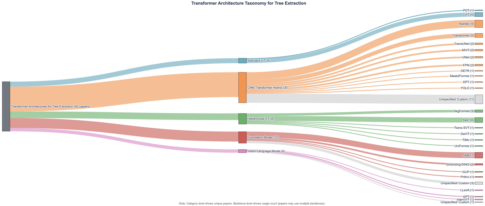
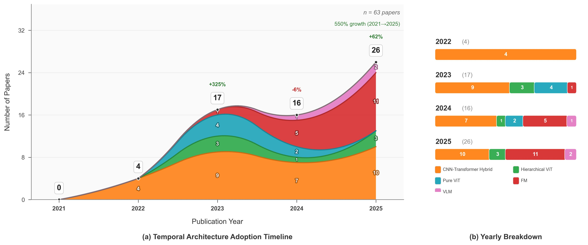
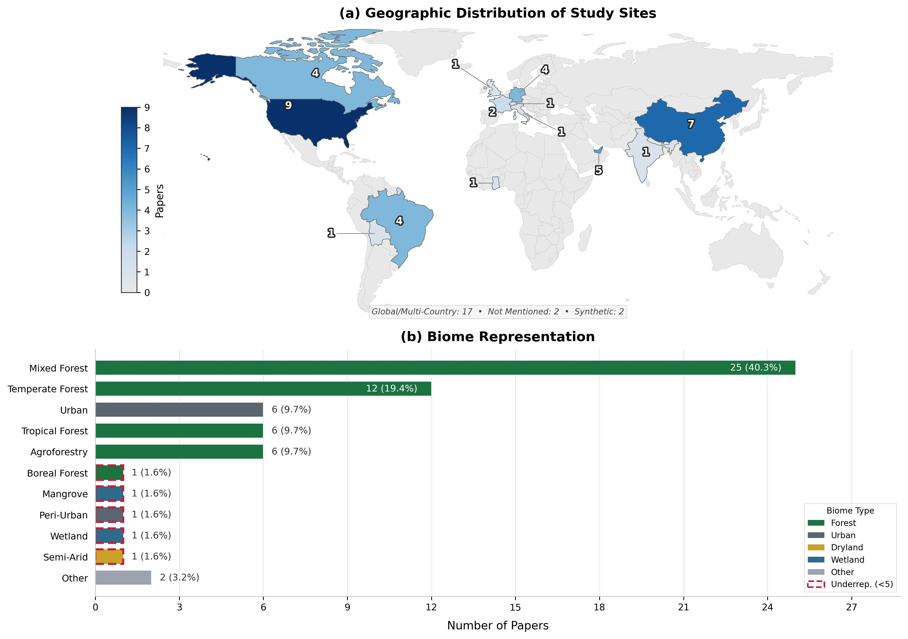
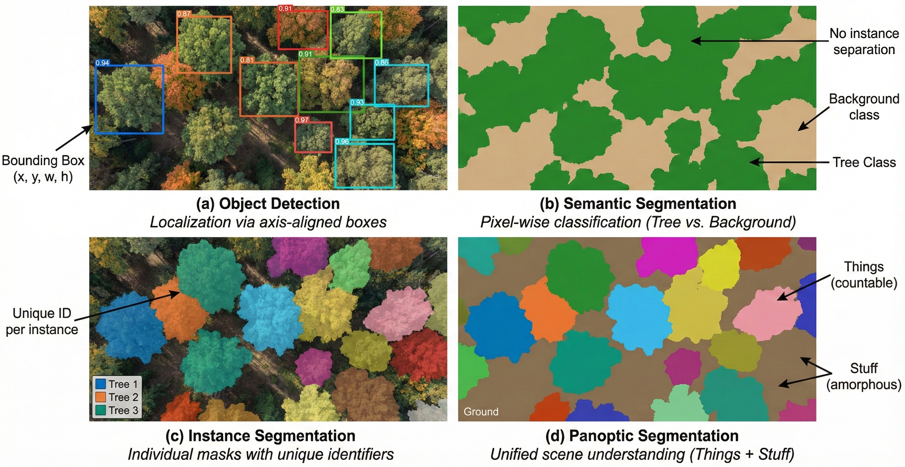

# Transformer-Based Tree Extraction from Remote Sensing Imagery: A Systematic Review

> Supplementary resource repository for our systematic literature review on transformer-based models applied to tree extraction from remote sensing imagery.

This repository serves as the comprehensive resource index for our systematic review covering transformer-based approaches for tree extraction from 2020-2025, providing direct access to papers, datasets, and available code implementations.

## 📄 Literature Review Paper

**Title**: Transformer-Based Tree Extraction from Remote Sensing Imagery: A Systematic Review  
**Authors**: Attavit Wilaiwongsakul, Bin Liang, Bryan Zheng, Fang Chen  
**Journal**: [Under Review]  
**Links**: 📖 [Paper](link) | 📦 [Supplementary Materials](link)

> **Abstract**: Scalable forest monitoring requires methods that are simultaneously accurate, generalizable across ecosystems, and trainable with limited labeled data. This survey systematically examines whether transformer-based architectures meet these demands for tree extraction tasks. We synthesize research spanning multiple continents, sensor modalities, and architectural paradigms, from Vision Transformers through CNN-transformer hybrids to Foundation Models.

## Table of Contents

- [📄 Literature Review Paper](#-literature-review-paper)
- [📊 Survey Figures](#-survey-figures)
- [📝 Literature Overview](#-literature-overview)
- [📚 Research Papers](#-research-papers)
  - [Pure Vision Transformers](#pure-vision-transformers)
  - [CNN-Transformer Hybrids](#cnn-transformer-hybrids)
  - [Hierarchical Vision Transformers](#hierarchical-vision-transformers)
  - [Foundation Models](#foundation-models)
  - [Vision-Language Models](#vision-language-models)
- [🏛️ Foundational Architectures](#️-foundational-architectures)
- [📖 Related Surveys](#-related-surveys)
- [📊 Datasets & Benchmarks](#-datasets--benchmarks)
- [🌍 Policy Context](#-policy-context)
- [🔧 Available Code & Tools](#-available-code--tools)
- [📑 Citation & Usage](#-citation--usage)

## 📊 Survey Figures

<p align="center">
  
</p>

**Figure 1**: Venn diagram of transformer architectures, tree extraction tasks and applications, and remote sensing and acquisition domains addressed in this survey.

<details>
<summary><b>📈 Click to view additional survey figures</b></summary>

### Architecture Distribution
<p align="center">
  
</p>

**Figure 2**: Sankey diagram showing the flow from backbone architectures to task-specific applications.

### Research Timeline
<p align="center">
  
</p>

**Figure 3**: Timeline of transformer-based tree extraction publications (2020-2025), showing 525% growth.

### Geographic Distribution
<p align="center">
  
</p>

**Figure 4**: Geographic distribution of study sites across 6 continents.

### Sensor Modalities
<p align="center">
  
</p>

**Figure 5**: Overview of sensor modalities used in transformer-based tree extraction.

### Task Summary
<p align="center">
  
</p>

**Figure 6**: Distribution of computer vision tasks addressed in the reviewed literature.

</details>

## 📝 Literature Overview

- **Research Papers**: 62 studies
- **Foundational Architectures**: 14 papers
- **Related Surveys**: 15 reviews
- **Dataset Papers**: 9 benchmarks
- **Time Period**: 2017-2025
- **Geographic Coverage**: Global (6 continents represented)
- **Architecture Types**: Foundation Models, Vision-Language Models, CNN-Transformer Hybrids, Hierarchical ViTs, Pure ViTs
- **Data Modalities**: RGB, Multispectral, Hyperspectral, LiDAR, SAR, Multi-modal fusion
- **Tasks**: Detection, Semantic Segmentation, Instance Segmentation, Classification, Height/Biomass Estimation
- **Last Updated**: December 2025

*For detailed categorization and systematic analysis, refer to our published literature review paper.*

## 📚 Research Papers

<h3><em>🔷 Pure Vision Transformers (5 papers)</em></h3>

<details>
<summary><b>[2025] Integrating Hyperspectral Images and LiDAR Data Using Vision Transformers for Enhanced Vegetation Classification</b></summary>

- **Authors**: Shu, X., Ma, L., Chang, F.
- **Venue**: Forests
- **Key Contribution**: PlantViT architecture for HSI-LiDAR fusion achieving state-of-the-art performance
- **Links**: 📖 [Paper](https://www.mdpi.com/1999-4907/16/4/620) | 📊 [Dataset](https://github.com/shuxquan/PlantViT)

</details>

<details>
<summary><b>[2023] Classification of Individual Tree Species Using UAV LiDAR Based on Transformer</b></summary>

- **Authors**: Sun, P., Yuan, X., Li, D.
- **Venue**: Forests
- **Key Contribution**: Pure transformer approach for 3D LiDAR tree species classification
- **Links**: 📖 [Paper](https://www.mdpi.com/1999-4907/14/3/484)

</details>

<details>
<summary><b>[2023] Application of the Vision Transformer and Mask R-CNN Joint Algorithm to Assist Forest Decisions</b></summary>

- **Authors**: Liang, Q.
- **Venue**: GRSM 2023
- **Key Contribution**: ViT-based decision support system for forest management
- **Links**: 📖 [Paper](https://ieeexplore.ieee.org/document/10344890)

</details>

<details>
<summary><b>[2022] A Vision Transformer Model for Convolution-Free Multilabel Classification of Satellite Imagery in Deforestation Monitoring</b></summary>

- **Authors**: Kaselimi, M., Voulodimos, A., Daskalopoulos, I., Doulamis, N., Doulamis, A.
- **Venue**: IEEE Transactions on Neural Networks and Learning Systems
- **Key Contribution**: First pure ViT for multi-label deforestation classification without convolutions
- **Links**: 📖 [Paper](https://ieeexplore.ieee.org/document/9606577)

</details>

<details>
<summary><b>[2022] 3D LiDAR Transformer for City-Scale Vegetation Segmentation and Biomass Estimation</b></summary>

- **Authors**: Khan, A., Asim, W., Ibrahim, M., Ulhaq, A.
- **Venue**: DICTA 2022
- **Key Contribution**: Point cloud transformer for urban vegetation analysis
- **Links**: 📖 [Paper](https://ieeexplore.ieee.org/document/9946512)

</details>

<h3><em>🔶 CNN-Transformer Hybrids (34 papers)</em></h3>

<details>
<summary><b>[2025] MTCDNet: Multimodal Feature Fusion-Based Tree Crown Detection Network</b></summary>

- **Authors**: Zhang, H., Yang, C., Fan, X.
- **Venue**: Remote Sensing
- **Key Contribution**: Multimodal CNN-Transformer fusion for tree crown detection from optical and LiDAR data
- **Links**: 📖 [Paper](https://www.mdpi.com/2072-4292/17/12/1996)

</details>

<details>
<summary><b>[2025] Semantic-Aware Cross-Modal Transfer for UAV-LiDAR Individual Tree Segmentation</b></summary>

- **Authors**: Zhou, F., He, H., Chen, T., Zhang, T., Yang, M., Yuan, Y., Liu, J.
- **Venue**: Remote Sensing
- **Key Contribution**: Cross-modal transfer learning between RGB and LiDAR for tree segmentation
- **Links**: 📖 [Paper](https://www.mdpi.com/2072-4292/17/16/2805)

</details>

<details>
<summary><b>[2025] ForestFormer3D: A Unified Framework for End-to-End Segmentation of Forest LiDAR 3D Point Clouds</b></summary>

- **Authors**: Xiang, B., Wielgosz, M., Puliti, S., Král, K., Krůček, M., Missarov, A., Astrup, R.
- **Venue**: arXiv preprint
- **Key Contribution**: End-to-end 3D transformer for forest point cloud segmentation
- **Links**: 📖 [Paper](https://arxiv.org/abs/2506.16991)

</details>

<details>
<summary><b>[2025] VibrantVS: A High-Resolution Vision Transformer for Forest Canopy Height Estimation</b></summary>

- **Authors**: Chang, T., Ndegwa, K., Gros, A., Landau, V.A., Zachmann, L.J., et al.
- **Venue**: Remote Sensing
- **Key Contribution**: High-resolution hybrid architecture for continental-scale canopy height mapping
- **Links**: 📖 [Paper](https://www.mdpi.com/2072-4292/17/6/1017)
</details>

<details>
<summary><b>[2025] Multi-Modal Uncertainty Robust Tree Cover Segmentation</b></summary>

- **Authors**: Gui, Y., Li, W., Wang, Y., Xia, X.G., Marty, M., Ginzler, C., Wang, Z.
- **Venue**: arXiv preprint
- **Key Contribution**: Uncertainty-aware multi-modal fusion for robust tree cover segmentation
- **Links**: 📖 [Paper](https://arxiv.org/abs/2509.04870)
</details>

<details>
<summary><b>[2025] Fine-Grained Individual Tree Crown Segmentation Based on High-Resolution Images</b></summary>

- **Authors**: Wang, Y., Dou, X., Liang, X.
- **Venue**: ISPRS Archives
- **Key Contribution**: Fine-grained segmentation approach for individual tree crowns
- **Links**: 📖 [Paper](https://isprs-archives.copernicus.org/articles/XLVIII-1-W4-2025/1529/2025/)
</details>

<details>
<summary><b>[2025] Bridging Classical and Modern Computer Vision: PerceptiveNet for Tree Crown Semantic Segmentation</b></summary>

- **Authors**: Voulgaris, G.
- **Venue**: CVPR 2025
- **Key Contribution**: Hybrid architecture combining classical CV with modern transformers
- **Links**: 📖 [Paper](https://openaccess.thecvf.com/content/CVPR2025/html/Voulgaris_Bridging_Classical_and_Modern_Computer_Vision_PerceptiveNet_for_Tree_Crown_CVPR_2025_paper.html)
</details>

<details>
<summary><b>[2025] Sustainable Forestry: AI-Driven Forest Health Diagnostics using Swin Transformer</b></summary>

- **Authors**: Begum, S.R., Mishra, V., Saha, D.
- **Venue**: AMATHE 2025
- **Key Contribution**: Swin-based forest health assessment system
- **Links**: 📖 [Paper](https://ieeexplore.ieee.org/document/10938576)
</details>

<details>
<summary><b>[2025] A Comprehensive Evaluation of Monocular Depth Estimation Methods in Low-Altitude Forest Environment</b></summary>

- **Authors**: Jia, J., Kang, J., Chen, L., Gao, X., Zhang, B., Yang, G.
- **Venue**: Remote Sensing
- **Key Contribution**: Comprehensive benchmark of transformer-based depth estimation for forests
- **Links**: 📖 [Paper](https://www.mdpi.com/2072-4292/17/4/717)
</details>

<details>
<summary><b>[2024] Large-Scale Assessment of Date Palm Plantations Based on UAV Remote Sensing and Multiscale Vision Transformer</b></summary>

- **Authors**: Gibril, M.B.A., Shafri, H.Z.M., Shanableh, A., Al-Ruzouq, R., et al.
- **Venue**: Remote Sensing Applications: Society and Environment
- **Key Contribution**: Multiscale ViT for large-scale date palm assessment
- **Links**: 📖 [Paper](https://www.sciencedirect.com/science/article/pii/S2352938524000119)
</details>

<details>
<summary><b>[2024] Spectral-Spatial Transformer-Based Semantic Segmentation for Large-Scale Mapping of Individual Date Palm Trees</b></summary>

- **Authors**: Al-Ruzouq, R., Gibril, M.B.A., Shanableh, A., Bolcek, J., et al.
- **Venue**: Ecological Indicators
- **Key Contribution**: Spectral-spatial transformer for individual tree mapping from WorldView-3
- **Links**: 📖 [Paper](https://www.sciencedirect.com/science/article/pii/S1470160X24005673)
</details>

<details>
<summary><b>[2024] e-TransUNet: TransUNet Provides a Strong Spatial Transformation for Precise Deforestation Mapping</b></summary>

- **Authors**: Jamali, A., Roy, S.K., Pradhan, B.
- **Venue**: Remote Sensing Applications: Society and Environment
- **Key Contribution**: Enhanced TransUNet with spatial transformation modules for deforestation mapping
- **Links**: 📖 [Paper](https://www.sciencedirect.com/science/article/pii/S2352938524000855)
</details>

<details>
<summary><b>[2024] Tree Species Classification from UAV Canopy Images with Deep Learning Models</b></summary>

- **Authors**: Huang, Y., Ou, B., Meng, K., Yang, B., Carpenter, J., Jung, J., Fei, S.
- **Venue**: Remote Sensing
- **Key Contribution**: Comprehensive comparison of CNN and transformer models for tree species classification
- **Links**: 📖 [Paper](https://www.mdpi.com/2072-4292/16/20/3836)
</details>

<details>
<summary><b>[2024] Expanding Vision in Tree Counting: Novel Ground Truth Generation and Deep Learning Model</b></summary>

- **Authors**: Ton-That, M.N., Le, T.V., Truong, N.H., Le, A.D., Pham, A.D., Vo, H.B.
- **Venue**: ICCE 2024
- **Key Contribution**: Novel ground truth generation approach for tree counting
- **Links**: 📖 [Paper](https://ieeexplore.ieee.org/document/10634582)
</details>

<details>
<summary><b>[2024] SSMM-DS: A Semantic Segmentation Model for Mangroves Based on DeepLabv3+ with Swin Transformer</b></summary>

- **Authors**: Wang, Z., Yang, J., Dong, C., Zhang, X., Yi, C., Sun, J.
- **Venue**: Electronic Research Archive
- **Key Contribution**: Swin-enhanced DeepLabv3+ for mangrove mapping
- **Links**: 📖 [Paper](https://www.aimspress.com/article/doi/10.3934/era.2024251)
</details>

<details>
<summary><b>[2024] Evaluating Deep Learning Methods Applied to Landsat Time Series for Boreal Forest Disturbance Detection</b></summary>

- **Authors**: Perbet, P., Guindon, L., Côté, J.F., Béland, M.
- **Venue**: Remote Sensing of Environment
- **Key Contribution**: Evaluation of transformer architectures for time series disturbance detection
- **Links**: 📖 [Paper](https://www.sciencedirect.com/science/article/pii/S0034425724000658)
</details>

<details>
<summary><b>[2024] M2FNet: Multi-Modal Forest Monitoring Network on Large-Scale Virtual Dataset</b></summary>

- **Authors**: Lu, Y., Huang, Y., Sun, S., Zhang, T., Zhang, X., Fei, S., Chen, V.
- **Venue**: IEEE VR 2024 Workshops
- **Key Contribution**: Multi-modal network trained on synthetic forest data
- **Links**: 📖 [Paper](https://ieeexplore.ieee.org/document/10536310)
</details>

<details>
<summary><b>[2024] Assessing the Generalization Capacity of CNNs and Vision Transformers for Deforestation Detection</b></summary>

- **Authors**: Vega, P.J.S., Torres, D.L., Andrade-Miranda, G.X., Feitosa, R.Q.
- **Venue**: ISPRS Archives
- **Key Contribution**: Generalization analysis of CNNs vs ViTs for deforestation detection
- **Links**: 📖 [Paper](https://isprs-archives.copernicus.org/articles/XLVIII-1-2024/519/2024/)
</details>

<details>
<summary><b>[2024] Transformer-Based Instance Segmentation with Multi-Scale Spectrum-Averaging Blend Queries</b></summary>

- **Authors**: Zhu, L., Lin, Y., Lin, C.W.
- **Venue**: ISCIPT 2024
- **Key Contribution**: Multi-scale query mechanism for tree instance segmentation
- **Links**: 📖 [Paper](https://ieeexplore.ieee.org/document/10634582)
</details>

<details>
<summary><b>[2023] TreeFormer: A Semi-Supervised Transformer-Based Framework for Tree Counting</b></summary>

- **Authors**: Amirkolaee, H.A., Shi, M., Mulligan, M.
- **Venue**: IEEE Transactions on Geoscience and Remote Sensing
- **Key Contribution**: Semi-supervised transformer for tree counting from single high-resolution images
- **Links**: 📖 [Paper](https://ieeexplore.ieee.org/document/10183842)
</details>

<details>
<summary><b>[2023] TransU-Net++: Rethinking Attention Gated TransU-Net for Deforestation Mapping</b></summary>

- **Authors**: Jamali, A., Roy, S.K., Li, J., Ghamisi, P.
- **Venue**: International Journal of Applied Earth Observation and Geoinformation
- **Key Contribution**: Attention-gated TransUNet variant for improved deforestation mapping
- **Links**: 📖 [Paper](https://www.sciencedirect.com/science/article/pii/S156984322300135X) | 💻 [Code](https://github.com/aj1365/TransUNetplus2)
</details>

<details>
<summary><b>[2023] WetMapFormer: A Unified Deep CNN and Vision Transformer for Complex Wetland Mapping</b></summary>

- **Authors**: Jamali, A., Roy, S.K., Ghamisi, P.
- **Venue**: International Journal of Applied Earth Observation and Geoinformation
- **Key Contribution**: Hybrid CNN-Transformer with Local Window Attention for wetland mapping
- **Links**: 📖 [Paper](https://www.sciencedirect.com/science/article/pii/S1569843223001553) | 💻 [Code](https://github.com/aj1365/WetMapFormer)
</details>

<details>
<summary><b>[2023] Vision Transformers, A New Approach for High-Resolution and Large-Scale Mapping of Canopy Heights</b></summary>

- **Authors**: Fayad, I., Ciais, P., Schwartz, M., Wigneron, J.P., Baghdadi, N., et al.
- **Venue**: Remote Sensing of Environment
- **Key Contribution**: Hy-TeC hybrid architecture for large-scale canopy height estimation using Sentinel-2 and GEDI
- **Links**: 📖 [Paper](https://arxiv.org/abs/2304.11487)
</details>

<details>
<summary><b>[2023] Large-Scale Date Palm Tree Segmentation from Multiscale UAV-Based and Aerial Images</b></summary>

- **Authors**: Gibril, M.B.A., Shafri, H.Z.M., Al-Ruzouq, R., Shanableh, A., Nahas, F., Al Mansoori, S.
- **Venue**: Drones
- **Key Contribution**: Deep vision transformers for multi-scale date palm segmentation
- **Links**: 📖 [Paper](https://www.mdpi.com/2504-446X/7/2/93)
</details>

<details>
<summary><b>[2023] Towards Complete Tree Crown Delineation by Instance Segmentation with Mask R-CNN and DETR</b></summary>

- **Authors**: Dersch, S., Schoettl, A., Krzystek, P., Heurich, M.
- **Venue**: ISPRS Open Journal of Photogrammetry and Remote Sensing
- **Key Contribution**: Comparison of Mask R-CNN and DETR for tree crown delineation
- **Links**: 📖 [Paper](https://www.sciencedirect.com/science/article/pii/S2667393223000042)
</details>

<details>
<summary><b>[2023] Tree Species Classification in UAV Remote Sensing Images Based on Super-Resolution and Deep Learning</b></summary>

- **Authors**: Huang, Y., Wen, X., Gao, Y., Zhang, Y., Lin, G.
- **Venue**: Remote Sensing
- **Key Contribution**: Super-resolution enhancement combined with transformer classification
- **Links**: 📖 [Paper](https://www.mdpi.com/2072-4292/15/11/2942)
</details>

<details>
<summary><b>[2023] Instance Segmentation of LiDAR Data with Vision Transformer Model for Inundation Mapping</b></summary>

- **Authors**: Yang, J., El Mendili, L., Khayer, Y., McArdle, S., Hashemi Beni, L.
- **Venue**: MDPI Preprints
- **Key Contribution**: ViT-based instance segmentation for LiDAR under forest canopy
- **Links**: 📖 [Paper](https://www.preprints.org/manuscript/202301.0001/v1)
</details>

<details>
<summary><b>[2023] Seasonal Forest Disturbance Detection Using Sentinel-1 SAR & Sentinel-2 Optical Data and Transformers</b></summary>

- **Authors**: Mullissa, A., Reiche, J., Saatchi, S.
- **Venue**: IGARSS 2023
- **Key Contribution**: Multi-temporal transformer for seasonal disturbance detection
- **Links**: 📖 [Paper](https://ieeexplore.ieee.org/document/10282817)
</details>

<details>
<summary><b>[2023] Fusing Sentinel-1 and Sentinel-2 Images with Transformer-Based Network for Deforestation Detection</b></summary>

- **Authors**: Ferrari, F., Ferreira, M.P., Feitosa, R.Q.
- **Venue**: ISPRS Annals
- **Key Contribution**: Transformer-based SAR-optical fusion for cloud-robust deforestation detection
- **Links**: 📖 [Paper](https://isprs-annals.copernicus.org/articles/X-1-W1-2023/999/2023/)
</details>

<details>
<summary><b>[2023] UAV4TREE: Deep Learning-Based System for Automatic Classification of Tree Species</b></summary>

- **Authors**: Pierdicca, R., Nepi, L., Mancini, A., Malinverni, E.S., Balestra, M.
- **Venue**: ISPRS Annals
- **Key Contribution**: End-to-end deep learning system for tree species classification
- **Links**: 📖 [Paper](https://isprs-annals.copernicus.org/articles/X-1-W1-2023/1089/2023/)
</details>

<details>
<summary><b>[2023] More Appropriate DenseNetBL Classifier for Small Sample Tree Species Classification</b></summary>

- **Authors**: Wang, N., Pu, T., Zhang, Y., Liu, Y., Zhang, Z.
- **Venue**: Heliyon
- **Key Contribution**: Attention-enhanced classifier for few-shot tree species identification
- **Links**: 📖 [Paper](https://www.sciencedirect.com/science/article/pii/S2405844023078294)
</details>

<details>
<summary><b>[2023] Benchmarking Individual Tree Mapping with Sub-Meter Imagery</b></summary>

- **Authors**: Gominski, D., Kariryaa, A., Brandt, M., Igel, C., Li, S., et al.
- **Venue**: arXiv preprint
- **Key Contribution**: Large-scale benchmark for individual tree mapping methods
- **Links**: 📖 [Paper](https://arxiv.org/abs/2311.07981)
</details>

<details>
<summary><b>[2022] Novel Single Tree Detection by Transformers Using UAV-Based Multispectral Imagery</b></summary>

- **Authors**: Dersch, S., Schöttl, A., Krzystek, P., Heurich, M.
- **Venue**: ISPRS Archives
- **Key Contribution**: First application of DETR for single tree detection from UAV imagery
- **Links**: 📖 [Paper](https://isprs-archives.copernicus.org/articles/XLIII-B2-2022/981/2022/)
</details>

<details>
<summary><b>[2022] Deep Convolutional Neural Networks and Swin Transformer-Based Frameworks for Individual Date Palm Tree Detection</b></summary>

- **Authors**: Gibril, M.B.A., Shafri, H.Z.M., Shanableh, A., Al-Ruzouq, R., et al.
- **Venue**: Geocarto International
- **Key Contribution**: Systematic comparison of CNN and Swin Transformer for tree detection
- **Links**: 📖 [Paper](https://www.tandfonline.com/doi/full/10.1080/10106049.2022.2142965)
</details>

<details>
<summary><b>[2022] Individual Tree Detection Based on High-Resolution RGB Images for Urban Forestry</b></summary>

- **Authors**: Zhang, L., Lin, H., Wang, F.
- **Venue**: IEEE Access
- **Key Contribution**: Transformer-enhanced detection for urban tree inventories
- **Links**: 📖 [Paper](https://ieeexplore.ieee.org/document/9765408)
</details>

<details>
<summary><b>[2020] Urban Trees Mapping Using Multi-Scale RGB Image and Deep Learning Vision Transformer-Based</b></summary>

- **Authors**: Georges Gomes, F.D., Furuya, M.T.G., Marcato Junior, J., et al.
- **Venue**: SSRN
- **Key Contribution**: Early application of ViT for urban tree mapping at multiple scales
- **Links**: 📖 [Paper](https://papers.ssrn.com/sol3/papers.cfm?abstract_id=4167085)
</details>

<h3><em>🔷 Hierarchical Vision Transformers (5 papers)</em></h3>

<details>
<summary><b>[2025] A Comparative Analysis of Deep Learning Methods for Ghaf Tree Detection and Segmentation</b></summary>

- **Authors**: Shanableh, H., Gibril, M.B.A., Mansour, A., Dixit, A., Al-Ruzouq, R., et al.
- **Venue**: ISPRS Annals
- **Key Contribution**: Comprehensive comparison including Swin variants for Ghaf tree mapping
- **Links**: 📖 [Paper](https://isprs-annals.copernicus.org/articles/X-1-2025/805/2025/)
</details>

<details>
<summary><b>[2025] Efficient Large-Scale Mapping of Acacia Tortilis Trees Using Transformer-Based Semantic Segmentation</b></summary>

- **Authors**: Gibril, M.B.A., Shanableh, A., Al-Ruzouq, R., Hammouri, N., et al.
- **Venue**: ISPRS Annals
- **Key Contribution**: Efficient hierarchical transformer for arid region tree mapping
- **Links**: 📖 [Paper](https://isprs-annals.copernicus.org/articles/X-1-2025/285/2025/)
</details>

<details>
<summary><b>[2025] Vision Transformer-Based Unhealthy Tree Crown Detection and Evaluation of Annotation Uncertainty</b></summary>

- **Authors**: Joshi, D., Witharana, C.
- **Venue**: Remote Sensing
- **Key Contribution**: First comprehensive ViT vs CNN comparison for forest health with uncertainty quantification
- **Links**: 📖 [Paper](https://www.mdpi.com/2072-4292/17/6/1066)
</details>

<details>
<summary><b>[2025] Transformer-Based Semantic Segmentation of Japanese Knotweed Using Twins-SVT</b></summary>

- **Authors**: Valicharla, S.K., Karimzadeh, R., Li, X., Park, Y.L.
- **Venue**: Information
- **Key Contribution**: Twins-SVT architecture for invasive species detection
- **Links**: 📖 [Paper](https://www.mdpi.com/2078-2489/16/9/741)
</details>

<details>
<summary><b>[2023] Instance Segmentation of LiDAR Data with Vision Transformer Model</b></summary>

- **Authors**: Yang, J., El Mendili, L., Khayer, Y., McArdle, S., Hashemi Beni, L.
- **Venue**: Preprints
- **Key Contribution**: Hierarchical ViT for 3D point cloud instance segmentation
- **Links**: 📖 [Paper](https://www.preprints.org/manuscript/202301.0001)
</details>

<h3><em>🟢 Foundation Models (14 papers)</em></h3>

<details>
<summary><b>[2025] FoMo-Net: Multi-Modal, Multi-Scale and Multi-Task Foundation Models for Forest Monitoring</b></summary>

- **Authors**: Bountos, N.I., Ouaknine, A., Papoutsis, I., Rolnick, D.
- **Venue**: AAAI Conference on Artificial Intelligence
- **Key Contribution**: First unified foundation model for forest monitoring with sensor-agnostic pre-training across 36 spectral bands
- **Links**: 📖 [Paper](https://arxiv.org/abs/2312.10114) | 💻 📊 [Code & Dataset](https://github.com/RolnickLab/FoMo-Bench)
</details>

<details>
<summary><b>[2025] TiMo: Spatiotemporal Foundation Model for Satellite Image Time Series</b></summary>

- **Authors**: Qin, X., Wang, D., Zhang, J., Wang, F., Su, X., Du, B., Zhang, L.
- **Venue**: arXiv preprint
- **Key Contribution**: Spatiotemporal foundation model for satellite time series with forest monitoring applications
- **Links**: 📖 [Paper](https://arxiv.org/abs/2505.08723)
</details>

<details>
<summary><b>[2025] SatelliteCalculator: Multi-Task Vision Foundation Model for Quantitative Remote Sensing Inversion</b></summary>

- **Authors**: Yu, Z., Idris, M., Wang, P.
- **Venue**: arXiv preprint
- **Key Contribution**: Multi-task foundation model for quantitative remote sensing including forest parameters
- **Links**: 📖 [Paper](https://arxiv.org/abs/2504.13442)
</details>

<details>
<summary><b>[2025] Monitoring Forest Changes with Foundation Models and Sentinel-2 Time Series</b></summary>

- **Authors**: Sadel, J., Tulczyjew, L., Wijata, A.M., Przeliorz, M., Nalepa, J.
- **Venue**: IEEE Geoscience and Remote Sensing Letters
- **Key Contribution**: Foundation model application for forest change detection using Sentinel-2
- **Links**: 📖 [Paper](https://ieeexplore.ieee.org/document/10938576)
</details>

<details>
<summary><b>[2025] Bringing SAM to New Heights: Leveraging Elevation Data for Tree Crown Segmentation</b></summary>

- **Authors**: Teng, M., Ouaknine, A., Laliberté, E., Bengio, Y., Rolnick, D., Larochelle, H.
- **Venue**: arXiv preprint
- **Key Contribution**: SAM adaptation with elevation data fusion for improved tree crown segmentation
- **Links**: 📖 [Paper](https://arxiv.org/abs/2506.04970)
</details>

<details>
<summary><b>[2025] Assessing SAM for Tree Crown Instance Segmentation from Drone Imagery</b></summary>

- **Authors**: Teng, M., Ouaknine, A., Laliberté, E., Bengio, Y., Rolnick, D., Larochelle, H.
- **Venue**: arXiv preprint
- **Key Contribution**: Comprehensive evaluation of SAM for tree crown instance segmentation
- **Links**: 📖 [Paper](https://arxiv.org/abs/2503.20199)
</details>

<details>
<summary><b>[2025] Zero-Shot Tree Detection and Segmentation from Aerial Forest Imagery</b></summary>

- **Authors**: Chen, M., Russell, D., Pallavoor, A., Young, D., Wu, J.
- **Venue**: arXiv preprint
- **Key Contribution**: Zero-shot tree detection using foundation models without task-specific training
- **Links**: 📖 [Paper](https://arxiv.org/abs/2506.03114)
</details>

<details>
<summary><b>[2025] Parameter-Efficient Fine-Tuning of Vision Foundation Model for Forest Floor Segmentation</b></summary>

- **Authors**: Wasil, M., Drak, A., Penfold, B., Scarton, L., Johenneken, M., Asteroth, A., Houben, S.
- **Venue**: arXiv preprint
- **Key Contribution**: PEFT methods for adapting foundation models to forest floor segmentation
- **Links**: 📖 [Paper](https://arxiv.org/abs/2505.08932)
</details>

<details>
<summary><b>[2025] Parameter-Efficient Fine-Tuning for Individual Tree Crown Detection and Species Classification</b></summary>

- **Authors**: Zhang, J., Lei, F., Fan, X.
- **Venue**: Remote Sensing
- **Key Contribution**: PEFT techniques for efficient tree crown detection and species identification
- **Links**: 📖 [Paper](https://www.mdpi.com/2072-4292/17/7/1272)
</details>

<details>
<summary><b>[2024] Leveraging Prompt-Based Segmentation Models and Large Dataset to Improve Detection of Trees</b></summary>

- **Authors**: Grondin, V., Massicotte, P., Gaha, M., Pomerleau, F., Giguère, P.
- **Venue**: Conference on Robots and Vision
- **Key Contribution**: SAM-based prompt segmentation for tree detection with large-scale training
- **Links**: 📖 [Paper](https://www.pubpub.org/pub/crv2024-leveraging-prompt-based)
</details>

<details>
<summary><b>[2024] A Distribution Shift Benchmark for Smallholder Agroforestry: Do Foundation Models Improve Geographic Generalization?</b></summary>

- **Authors**: Sachdeva, S., Lopez, I., Biradar, C., Lobell, D.
- **Venue**: ICLR 2024
- **Key Contribution**: Benchmark for evaluating foundation model generalization across geographic domains
- **Links**: 📖 [Paper](https://openreview.net/forum?id=GnLRdCdNUp)
</details>

<details>
<summary><b>[2024] Estimating Urban Forests Biomass with LiDAR by Using Deep Learning Foundation Models</b></summary>

- **Authors**: Liu, H., Mou, C., Yuan, J., Chen, Z., Zhong, L., Cui, X.
- **Venue**: Remote Sensing
- **Key Contribution**: Foundation model application for urban forest biomass estimation from LiDAR
- **Links**: 📖 [Paper](https://www.mdpi.com/2072-4292/16/9/1643)
</details>

<details>
<summary><b>[2024] TreeSeg: A Toolbox for Fully Automated Tree Crown Segmentation</b></summary>

- **Authors**: Speckenwirth, S., Brandmeier, M., Paczkowski, S.
- **Venue**: Remote Sensing
- **Key Contribution**: End-to-end toolbox combining SAM with multispectral UAV data for tree segmentation
- **Links**: 📖 [Paper](https://www.mdpi.com/2072-4292/16/19/3660)
</details>

<details>
<summary><b>[2024] Fine-Tuning of Geospatial Foundation Models for Aboveground Biomass Estimation</b></summary>

- **Authors**: Muszynski, M., Klein, L., Da Silva, A.F., et al.
- **Venue**: arXiv preprint
- **Key Contribution**: Evaluation of geospatial foundation model fine-tuning for biomass estimation
- **Links**: 📖 [Paper](https://arxiv.org/abs/2406.19888)
</details>

<h3><em>🟣 Vision-Language Models (4 papers)</em></h3>

<details>
<summary><b>[2025] EarthDial: Turning Multi-Sensory Earth Observations to Interactive Dialogues</b></summary>

- **Authors**: Soni, S., Dudhane, A., Debary, H., Fiaz, M., Munir, M.A., Danish, M.S., et al.
- **Venue**: CVPR 2025
- **Key Contribution**: Multi-sensory VLM for interactive earth observation analysis including forest monitoring
- **Links**: 📖 [Paper](https://arxiv.org/abs/2411.09191)
</details>

<details>
<summary><b>[2025] GeoLangBind: Unifying Earth Observation with Agglomerative Vision-Language Foundation Models</b></summary>

- **Authors**: Xiong, Z., Wang, Y., Yu, W., Stewart, A.J., Zhao, J., Lehmann, N., et al.
- **Venue**: arXiv preprint
- **Key Contribution**: Unified vision-language foundation model for diverse earth observation tasks
- **Links**: 📖 [Paper](https://arxiv.org/abs/2503.06312)
</details>

<details>
<summary><b>[2024] REO-VLM: Transforming VLM to Meet Regression Challenges in Earth Observation</b></summary>

- **Authors**: Xue, X., Wei, G., Chen, H., Zhang, H., Lin, F., Shen, C., Zhu, X.X.
- **Venue**: arXiv preprint
- **Key Contribution**: VLM adaptation for regression tasks in remote sensing including forest parameters
- **Links**: 📖 [Paper](https://arxiv.org/abs/2412.16583)
</details>

<details>
<summary><b>[2023] Tree-GPT: Modular Large Language Model Expert System for Forest Remote Sensing Image Understanding</b></summary>

- **Authors**: Du, S., Tang, S., Wang, W., Li, X., Guo, R.
- **Venue**: arXiv preprint
- **Key Contribution**: First LLM-based expert system specifically designed for forest remote sensing analysis
- **Links**: 📖 [Paper](https://arxiv.org/abs/2310.04698)
</details>

## 🏛️ Foundational Architectures

These seminal papers introduced the core transformer architectures adapted for tree extraction tasks.

### Original Transformer
**[2017] Attention Is All You Need**
- **Authors**: Vaswani, A., Shazeer, N., Parmar, N., Uszkoreit, J., Jones, L., Gomez, A.N., Kaiser, Ł., Polosukhin, I.
- **Venue**: NeurIPS 2017
- **Key Contribution**: Introduced the transformer architecture with self-attention mechanism
- **Links**: 📖 [Paper](https://arxiv.org/abs/1706.03762)

### Vision Transformers
**[2020] An Image is Worth 16x16 Words: Transformers for Image Recognition at Scale (ViT)**
- **Authors**: Dosovitskiy, A., Beyer, L., Kolesnikov, A., Weissenborn, D., Zhai, X., et al.
- **Venue**: ICLR 2021
- **Key Contribution**: First pure transformer architecture for image classification
- **Links**: 📖 [Paper](https://arxiv.org/abs/2010.11929) | 💻 [Code](https://github.com/google-research/vision_transformer)

**[2021] Swin Transformer: Hierarchical Vision Transformer using Shifted Windows**
- **Authors**: Liu, Z., Lin, Y., Cao, Y., Hu, H., Wei, Y., Zhang, Z., Lin, S., Guo, B.
- **Venue**: ICCV 2021
- **Key Contribution**: Hierarchical transformer with shifted window attention for efficient multi-scale processing
- **Links**: 📖 [Paper](https://arxiv.org/abs/2103.14030) | 💻 [Code](https://github.com/microsoft/Swin-Transformer)

**[2021] Pyramid Vision Transformer: A Versatile Backbone for Dense Prediction**
- **Authors**: Wang, W., Xie, E., Li, X., Fan, D.P., Song, K., Liang, D., Lu, T., Luo, P., Shao, L.
- **Venue**: ICCV 2021
- **Key Contribution**: Multi-scale pyramid structure for dense prediction tasks
- **Links**: 📖 [Paper](https://arxiv.org/abs/2102.12122) | 💻 [Code](https://github.com/whai362/PVT)

**[2021] Twins: Revisiting the Design of Spatial Attention in Vision Transformers**
- **Authors**: Chu, X., Tian, Z., Wang, Y., Zhang, B., Ren, H., Wei, X., Xia, H., Shen, C.
- **Venue**: NeurIPS 2021
- **Key Contribution**: Spatially separable self-attention for efficient vision transformers
- **Links**: 📖 [Paper](https://arxiv.org/abs/2104.13840) | 💻 [Code](https://github.com/Meituan-AutoML/Twins)

**[2022] DaViT: Dual Attention Vision Transformers**
- **Authors**: Ding, M., Xiao, B., Codella, N., Luo, P., Wang, J., Yuan, L.
- **Venue**: ECCV 2022
- **Key Contribution**: Combines spatial and channel attention for improved representation
- **Links**: 📖 [Paper](https://arxiv.org/abs/2204.03645) | 💻 [Code](https://github.com/dingmyu/davit)

### Segmentation Architectures
**[2021] SegFormer: Simple and Efficient Design for Semantic Segmentation with Transformers**
- **Authors**: Xie, E., Wang, W., Yu, Z., Anandkumar, A., Alvarez, J.M., Luo, P.
- **Venue**: NeurIPS 2021
- **Key Contribution**: Lightweight transformer encoder with MLP decoder for efficient segmentation
- **Links**: 📖 [Paper](https://arxiv.org/abs/2105.15203) | 💻 [Code](https://github.com/NVlabs/SegFormer)

**[2021] SETR: Rethinking Semantic Segmentation from a Sequence-to-Sequence Perspective**
- **Authors**: Zheng, S., Lu, J., Zhao, H., Zhu, X., Luo, Z., Wang, Y., Fu, Y., Feng, J., Xiang, T., Torr, P.H.
- **Venue**: CVPR 2021
- **Key Contribution**: Pure transformer encoder for semantic segmentation
- **Links**: 📖 [Paper](https://arxiv.org/abs/2012.15840) | 💻 [Code](https://github.com/fudan-zvg/SETR)

**[2021] TransUNet: Transformers Make Strong Encoders for Medical Image Segmentation**
- **Authors**: Chen, J., Lu, Y., Yu, Q., Luo, X., Adeli, E., Wang, Y., Lu, L., Yuille, A.L., Zhou, Y.
- **Venue**: arXiv preprint
- **Key Contribution**: Hybrid CNN-Transformer for U-Net style segmentation
- **Links**: 📖 [Paper](https://arxiv.org/abs/2102.04306) | 💻 [Code](https://github.com/Beckschen/TransUNet)

**[2022] Mask2Former: Masked-Attention Mask Transformer for Universal Image Segmentation**
- **Authors**: Cheng, B., Misra, I., Schwing, A.G., Kirillov, A., Girdhar, R.
- **Venue**: CVPR 2022
- **Key Contribution**: Universal architecture for semantic, instance, and panoptic segmentation
- **Links**: 📖 [Paper](https://arxiv.org/abs/2112.01527) | 💻 [Code](https://github.com/facebookresearch/Mask2Former)

**[2023] UniFormer: Unifying Convolution and Self-attention for Visual Recognition**
- **Authors**: Li, K., Wang, Y., Zhang, J., Gao, P., Song, G., Liu, Y., Li, H., Qiao, Y.
- **Venue**: IEEE TPAMI
- **Key Contribution**: Unified convolution and self-attention in single transformer block
- **Links**: 📖 [Paper](https://arxiv.org/abs/2201.09450) | 💻 [Code](https://github.com/Sense-X/UniFormer)

### Detection & Foundation Models
**[2020] DETR: End-to-End Object Detection with Transformers**
- **Authors**: Carion, N., Massa, F., Synnaeve, G., Usunier, N., Kirillov, A., Zagoruyko, S.
- **Venue**: ECCV 2020
- **Key Contribution**: First transformer-based end-to-end object detector
- **Links**: 📖 [Paper](https://arxiv.org/abs/2005.12872) | 💻 [Code](https://github.com/facebookresearch/detr)

**[2021] CLIP: Learning Transferable Visual Models From Natural Language Supervision**
- **Authors**: Radford, A., Kim, J.W., Hallacy, C., Ramesh, A., Goh, G., et al.
- **Venue**: ICML 2021
- **Key Contribution**: Vision-language pre-training enabling zero-shot transfer
- **Links**: 📖 [Paper](https://arxiv.org/abs/2103.00020) | 💻 [Code](https://github.com/openai/CLIP)

**[2023] Segment Anything (SAM)**
- **Authors**: Kirillov, A., Mintun, E., Ravi, N., Mao, H., Rolland, C., Gustafson, L., et al.
- **Venue**: ICCV 2023
- **Key Contribution**: Promptable foundation model for image segmentation
- **Links**: 📖 [Paper](https://arxiv.org/abs/2304.02643) | 💻 [Code](https://github.com/facebookresearch/segment-anything)

**[2024] Grounding DINO: Marrying DINO with Grounded Pre-Training for Open-Set Object Detection**
- **Authors**: Liu, S., Zeng, Z., Ren, T., Li, F., Zhang, H., Yang, J., et al.
- **Venue**: ECCV 2024
- **Key Contribution**: Open-set detection with language grounding
- **Links**: 📖 [Paper](https://arxiv.org/abs/2303.05499) | 💻 [Code](https://github.com/IDEA-Research/GroundingDINO)

## 📖 Related Surveys

### Tree Detection & Forest Monitoring Reviews
**[2025] A Review of Individual Tree Crown Detection and Delineation From Optical Remote Sensing Images**
- **Authors**: Zheng, J., Yuan, S., Li, W., Fu, H., Yu, L., Huang, J.
- **Venue**: IEEE Geoscience and Remote Sensing Magazine
- **Links**: 📖 [Paper](https://ieeexplore.ieee.org/document/10729869)

**[2025] Advances in the Automated Identification of Individual Tree Species: A Systematic Review of Drone- and AI-Based Methods**
- **Authors**: Abreu-Dias, R., Santos-Gago, J.M., Martín-Rodríguez, F., Álvarez-Sabucedo, L.M.
- **Venue**: Technologies
- **Links**: 📖 [Paper](https://www.mdpi.com/2227-7080/13/5/187)

**[2024] A Review: Tree Species Classification Based on Remote Sensing Data and Classic Deep Learning-Based Methods**
- **Authors**: Zhong, L., Dai, Z., Fang, P., Cao, Y., Wang, L.
- **Venue**: Forests
- **Links**: 📖 [Paper](https://www.mdpi.com/1999-4907/15/5/852)

**[2023] A Systematic Review of Individual Tree Crown Detection and Delineation with CNNs**
- **Authors**: Zhao, H., Morgenroth, J., Pearse, G., Schindler, J.
- **Venue**: Current Forestry Reports
- **Links**: 📖 [Paper](https://link.springer.com/article/10.1007/s40725-023-00184-3)

**[2023] Latest Trends on Tree Classification and Segmentation Using UAV Data: A Review of Agroforestry Applications**
- **Authors**: Chehreh, B., Moutinho, A., Viegas, C.
- **Venue**: Remote Sensing
- **Links**: 📖 [Paper](https://www.mdpi.com/2072-4292/15/9/2263)

**[2023] Machine Learning Assisted Remote Forestry Health Assessment: A Comprehensive State of the Art Review**
- **Authors**: Estrada, J.S., Fuentes, A., Reszka, P., Auat Cheein, F.
- **Venue**: Frontiers in Plant Science
- **Links**: 📖 [Paper](https://www.frontiersin.org/articles/10.3389/fpls.2023.1139232)

**[2021] Deep Learning in Forestry Using UAV-Acquired RGB Data: A Practical Review**
- **Authors**: Diez, Y., Kentsch, S., Fukuda, M., Caceres, M.L.L., Moritake, K., Cabezas, M.
- **Venue**: Remote Sensing
- **Links**: 📖 [Paper](https://www.mdpi.com/2072-4292/13/14/2837)

**[2021] Remotely Sensed Tree Characterization in Urban Areas: A Review**
- **Authors**: Velasquez-Camacho, L., Cardil, A., Mohan, M., Etxegarai, M., Anzaldi, G., de-Miguel, S.
- **Venue**: Remote Sensing
- **Links**: 📖 [Paper](https://www.mdpi.com/2072-4292/13/23/4889)

### Transformers in Remote Sensing & Vision
**[2025] Vision Foundation Models in Remote Sensing: A Survey**
- **Authors**: Lu, S., Guo, J., Zimmer-Dauphinee, J.R., Nieusma, J.M., Wang, X., Wernke, S.A., Huo, Y.
- **Venue**: IEEE Geoscience and Remote Sensing Magazine
- **Links**: 📖 [Paper](https://ieeexplore.ieee.org/document/10804094)

**[2025] Advancements in Vision-Language Models for Remote Sensing: Datasets, Capabilities, and Enhancement Techniques**
- **Authors**: Tao, L., Zhang, H., Jing, H., Liu, Y., Yan, D., Wei, G., Xue, X.
- **Venue**: Remote Sensing
- **Links**: 📖 [Paper](https://www.mdpi.com/2072-4292/17/1/162)

**[2024] Transformers for Remote Sensing: A Systematic Review and Analysis**
- **Authors**: Wang, R., Ma, L., He, G., Johnson, B.A., Yan, Z., Chang, M., Liang, Y.
- **Venue**: Sensors
- **Links**: 📖 [Paper](https://www.mdpi.com/1424-8220/24/11/3495)

**[2024] Transformer-Based Visual Segmentation: A Survey**
- **Authors**: Li, X., Ding, H., Yuan, H., Zhang, W., Pang, J., Cheng, G., Chen, K., Liu, Z., Loy, C.C.
- **Venue**: IEEE TPAMI
- **Links**: 📖 [Paper](https://ieeexplore.ieee.org/document/10478596)

**[2023] Transformers in Remote Sensing: A Survey**
- **Authors**: Aleissaee, A.A., Kumar, A., Anwer, R.M., Khan, S., Cholakkal, H., Xia, G.S., Khan, F.S.
- **Venue**: Remote Sensing
- **Links**: 📖 [Paper](https://www.mdpi.com/2072-4292/15/7/1860)

**[2023] A Survey of Visual Transformers**
- **Authors**: Liu, Y., Zhang, Y., Wang, Y., Hou, F., Yuan, J., Tian, J., Zhang, Y., Shi, Z., Fan, J., He, Z.
- **Venue**: IEEE TNNLS
- **Links**: 📖 [Paper](https://ieeexplore.ieee.org/document/9716741)

**[2022] Transformers in Vision: A Survey**
- **Authors**: Khan, S., Naseer, M., Hayat, M., Zamir, S.W., Khan, F.S., Shah, M.
- **Venue**: ACM Computing Surveys
- **Links**: 📖 [Paper](https://dl.acm.org/doi/10.1145/3505244)

## 📊 Datasets & Benchmarks

### Global Scale Datasets
- **FoMo-Bench**: Unified benchmark with 15 datasets for multi-task forest monitoring | 📊 [Dataset](https://github.com/RolnickLab/FoMo-Bench)
- **TalloS**: Global tree species classification dataset with >1,000 species | 📊 [Dataset](https://github.com/RolnickLab/FoMo-Bench)
- **Open-Canopy**: Very high resolution forest monitoring dataset | 📊 [Dataset](https://github.com/fajwel/Open-Canopy)

### Regional Scale Datasets
- **NEON Tree Crowns**: Co-registered RGB, LiDAR, hyperspectral for US forests | 📊 [Dataset](https://zenodo.org/record/5914554)
- **FOR-instance**: UAV laser scanning benchmark for individual tree segmentation | 📊 [Dataset](https://zenodo.org/record/8287792)
- **ReforesTree**: Tropical forest restoration monitoring | 📊 [Dataset](https://github.com/gyrrei/ReforesTree)
- **UAE Date Palm**: WorldView-3 individual tree mapping dataset
- **Connecticut Forest Health**: NAIP imagery with uncertainty annotations

### Standard Benchmarks
- **Trento**: HSI-LiDAR vegetation classification benchmark (6 classes) | 📊 [Dataset](https://github.com/shuxquan/PlantViT/tree/main/trento)
- **Houston 2013**: HSI-LiDAR urban vegetation benchmark (15 classes) | 📊 [Dataset](https://github.com/shuxquan/PlantViT/tree/main/Houston%202013)
- **LandCover.AI**: Aerial imagery for woodland mapping | 📊 [Dataset](https://landcover.ai/)
- **Semantic3D**: Large-scale point cloud classification | 📊 [Dataset](http://www.semantic3d.net/)
- **DynamicEarthNet**: Daily multi-spectral satellite dataset for change segmentation | 📊 [Dataset](https://mediatum.ub.tum.de/1650201)

### Dataset Papers

**[2025] Open-Canopy: Towards Very High Resolution Forest Monitoring**
- **Authors**: Fogel, F., Perron, Y., Besic, N., Saint-André, L., et al.
- **Venue**: CVPR 2025
- **Links**: 📖 [Paper](https://arxiv.org/abs/2501.02314) | 📊 [Dataset](https://github.com/fajwel/Open-Canopy)

**[2024] Influence of Temperate Forest Autumn Leaf Phenology on Segmentation of Tree Species from UAV Imagery**
- **Authors**: Cloutier, M., Germain, M., Laliberté, E.
- **Venue**: Remote Sensing of Environment
- **Links**: 📖 [Paper](https://www.sciencedirect.com/science/article/pii/S0034425724002980)

**[2023] FOR-instance: A UAV Laser Scanning Benchmark Dataset for Semantic and Instance Segmentation**
- **Authors**: Puliti, S., Pearse, G., Surový, P., Wallace, L., Hollaus, M., Wielgosz, M., Astrup, R.
- **Venue**: arXiv preprint
- **Links**: 📖 [Paper](https://arxiv.org/abs/2309.01279) | 📊 [Dataset](https://zenodo.org/record/8287792)

**[2023] Accurate Delineation of Individual Tree Crowns in Tropical Forests from Aerial RGB Imagery**
- **Authors**: Ball, J.G., Hickman, S.H., Jackson, T.D., et al.
- **Venue**: Remote Sensing in Ecology and Conservation
- **Links**: 📖 [Paper](https://zslpublications.onlinelibrary.wiley.com/doi/10.1002/rse2.323)

**[2021] A Benchmark Dataset for Canopy Crown Detection and Delineation (NEON)**
- **Authors**: Weinstein, B.G., Graves, S.J., Marconi, S., Singh, A., et al.
- **Venue**: PLoS Computational Biology
- **Links**: 📖 [Paper](https://journals.plos.org/ploscompbiol/article?id=10.1371/journal.pcbi.1009180) | 📊 [Dataset](https://zenodo.org/record/5914554)

## 🌍 Policy Context

These policy documents and frameworks drive the demand for scalable tree monitoring systems.

**[2025] The Transformative Potential of the EU's Nature Restoration Law**
- **Authors**: Penca, J., Tănăsescu, M.
- **Venue**: Sustainability Science
- **Key Context**: EU binding obligations for ecosystem restoration requiring individual tree monitoring
- **Links**: 📖 [Paper](https://link.springer.com/article/10.1007/s11625-024-01594-5)

**[2024] Understanding i-Tree: 2023 Summary of Programs and Methods**
- **Authors**: Nowak, D.J.
- **Venue**: USDA Forest Service General Technical Report
- **Key Context**: Standard tools for urban forest ecosystem services quantification
- **Links**: 📖 [Paper](https://www.fs.usda.gov/research/treesearch/67182)

**[2019] The Global Tree Restoration Potential**
- **Authors**: Bastin, J.F., Finegold, Y., Garcia, C., Mollicone, D., Rezende, M., et al.
- **Venue**: Science
- **Key Context**: Quantification of global tree restoration capacity for climate mitigation
- **Links**: 📖 [Paper](https://www.science.org/doi/10.1126/science.aax0848)

**[2017] The Key Role of Forests in Meeting Climate Targets Requires Science for Credible Mitigation**
- **Authors**: Grassi, G., House, J., Dentener, F., Federici, S., Den Elzen, M., Penman, J.
- **Venue**: Nature Climate Change
- **Key Context**: Scientific basis for forest carbon accounting in Paris Agreement implementation
- **Links**: 📖 [Paper](https://www.nature.com/articles/nclimate3227)

**[2016] Transforming Our World: Implementing the 2030 Agenda through SDG Indicators**
- **Authors**: Lee, B.X., Kjaerulf, F., Turner, S., Cohen, L., et al.
- **Venue**: Journal of Public Health Policy
- **Key Context**: UN 2030 Agenda framework including SDG 13 (Climate Action) and SDG 15 (Life on Land)
- **Links**: 📖 [Paper](https://link.springer.com/article/10.1057/s41271-016-0002-7)

## 🔧 Available Code & Tools

### Foundation Models & Pre-trained Weights
- **FoMo-Net**: Sensor-agnostic foundation model for forest monitoring | 💻 [Code](https://github.com/RolnickLab/FoMo-Bench)
- **PlantViT**: HSI-LiDAR specialized transformer | 💻 [Code](https://github.com/shuxquan/PlantViT)

### Model Implementations
- **TransU-Net++**: Enhanced TransUNet for deforestation | 💻 [Code](https://github.com/aj1365/TransUNetplus2)
- **WetMapFormer**: Hybrid CNN-Transformer with Local Window Attention | 💻 [Code](https://github.com/aj1365/WetMapFormer)
- **TreeSeg Toolbox**: End-to-end tree crown segmentation | 💻 [Code](https://github.com/SoenkeSpeckenwirth/TreeSeg)

### Evaluation Frameworks
- **FoMo-Bench**: Unified evaluation framework for forest monitoring tasks | 💻 [Code](https://github.com/RolnickLab/FoMo-Bench)

## 📑 Citation & Usage

### How to Cite This Repository

If you use this repository or find it helpful for your research, please cite our systematic review:

```bibtex
@article{wilaiwongsakul2025transformer,
  title={Transformer-Based Tree Extraction from Remote Sensing Imagery: A Systematic Review},
  author={Wilaiwongsakul, Attavit and Liang, Bin and Zheng, Bryan and Chen, Fang},
  journal={[Journal Name]},
  year={2025},
  note={Supplementary repository: \url{https://github.com/attavit14203638/transformer-tree-survey}}
}
```

### Repository Usage

This repository serves as:
- **Resource Index**: Quick access to papers, datasets, and code implementations
- **Research Starting Point**: Comprehensive overview of transformer applications in tree extraction
- **Supplementary Material**: Supporting resource for our systematic literature review

### Updates

- **Last Updated**: December 2025
- **Papers Covered**: 62 studies (2020-2025)
- **Coverage**: Foundation Models, Vision-Language Models, CNN-Transformer Hybrids, Hierarchical ViTs, Pure ViTs

### Contact

For questions about this repository or the literature review:
- **Issues**: Use GitHub Issues for corrections or suggestions
- **Research Inquiries**: Contact corresponding author via paper publication

---

## 📄 License

This repository is licensed under the [MIT License](LICENSE).

> **Disclaimer**: This repository provides links and references to existing research. All papers, datasets, and code implementations remain under their original licenses and terms of use.
